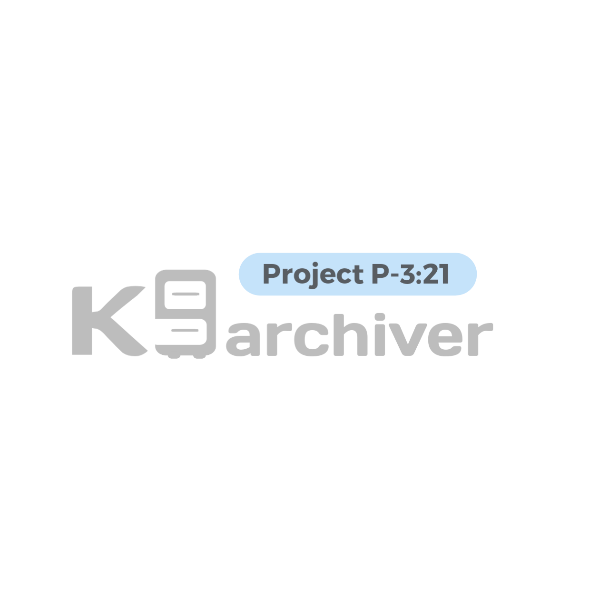
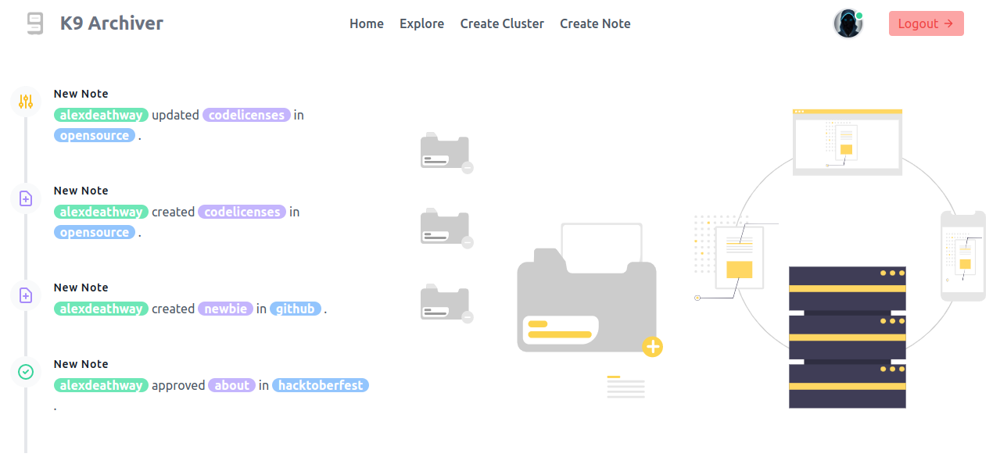
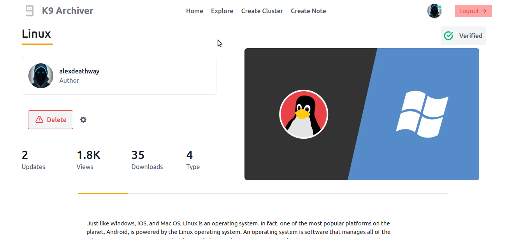
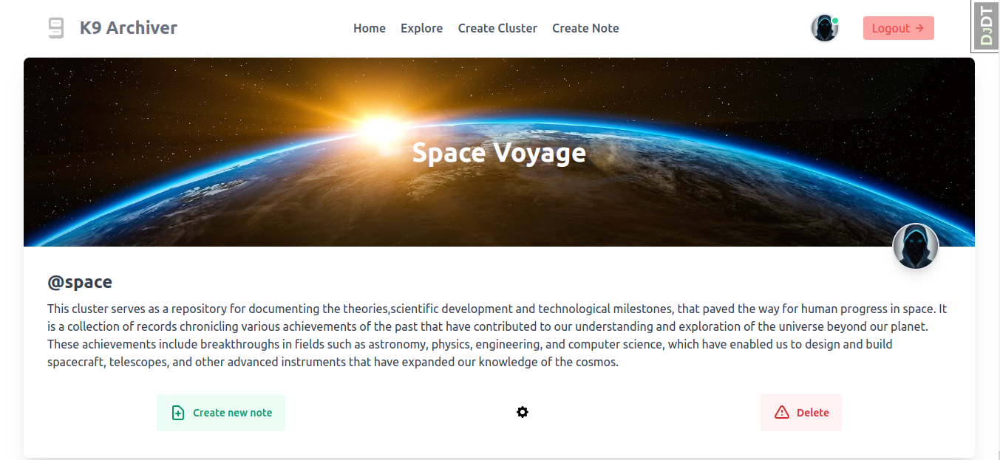

# k9archiver
<div align="center">


[](https://github.com/alexdeathway/k9archiver/actions/workflows/test.yaml)  [](https://github.com/alexdeathway/k9archiver/actions/workflows/deploy.yaml)
</div>
<hr>

## What it isn't ?
This isn't bookmark helper or presentation maker. Tweaking might help it to act one.

## What it is ?
This is a self-hosted website that can be used to Log/Note/journal almost anything by an individual or community. 


**Resources**
   
 - [Read project overview (Developers)](). 

---
## Screenshots
**Home Page Section** 



**Note Page Section** 


**Cluster Page Section** 


---
**Quick development Guide**

> ⚠️ Data used for/in dummy media/database isn't owned or licensed under this project and is here for sole purpose of setting up quick development and testing environment, do not publish or distribute.

### Using Docker 
1. Create .env file
```python
mv template.env .env
```
2. Start development docker
```python
sudo docker-compose -f docker-compose.yml up --build
```

### Using virtualenv

1. Create .env file
```python
mv template.env .env
```

2. Create virtual environment
```python
virtualenv <environment name>
```

3. Install required packages
```python
pip install -r requirements.txt
```
4. Run migrations and  Load dummy data to database
```python
python manage.py migrate
python manage.py loaddata db.json
```

5. Read project overview for app & structure understanding. 

6. Choose issue or work on own feature.

---